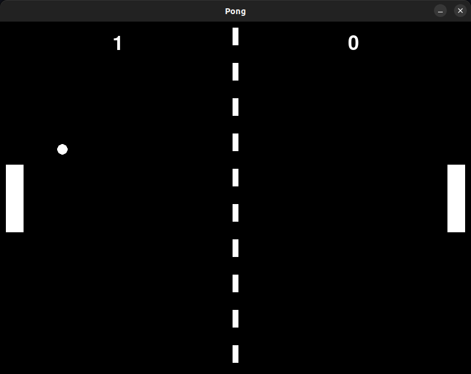
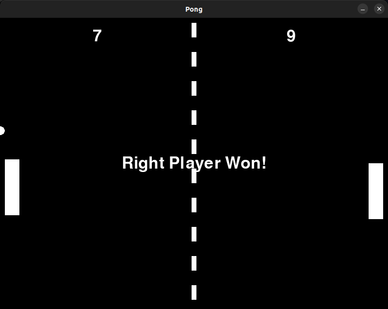

# Pong Game Using Python

## Description

Pong Game is a classic arcade game where two players control one paddle each and compete to reach 10 points to win the game. The game is built using Pygame, a popular Python library for game development.



## Installation

To run this game, you need to have Python installed on your machine. Additionally, you need to install the required packages listed in the `requirements.txt` file. You can do this by running the following command:

```bash
pip install -r requirements.txt
```

## Usage
- The left paddle is controlled using the W and S keys.
- The right paddle is controlled using the UP and DOWN arrow keys.
- The game displays a message in the middle of the - screen when a player wins.



## Contributing
This project is intended as a simple, fun project and may not require contributions. However, if you have any suggestions or improvements, feel free to fork the repository and create a pull request.

## License
This project is licensed under the MIT License. See the LICENSE file for details.

# Contact Information
You can reach me via the following platforms:

[](mailto:mahdirafati680@gmail.com)
[](https://www.linkedin.com/in/mahdi-rafati-97420a197/)
[](https://www.hopp.bio/mehdirt)
[](https://medium.com/@mehdirt)
[](https://www.kaggle.com/mahdirafati)
[](https://x.com/itsmehdirt)
